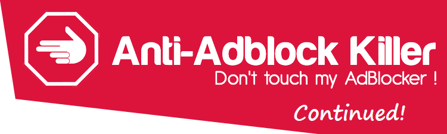

# End-Of-Life (Updated)

As many of you might have noticed, the original announcement below is no longer up-to-date. AdBlock Protector 2 ended up not working out and is canceled. 

I learnt, this time, that projects that developers don't personally use won't survive. It was fun implementing a small part of it, then it gets boring 
and I find myself having better things to do. 

I always wanted a syntax highlighter in uBlock Origin, after being convinced that gorhill will never add that, I decided to start a fork, namely, 
[Nano](https://github.com/NanoAdblocker/NanoCore). I also took this chance to properly integrate Nano Defender (previously uBlock Protector) to make 
configuration easier. 

I will also unhide the issues tracker for historical significance. If you want to take over this project, please let me know.

Also, if you still want to use this project, the final build can be found [here](FINAL_BUILD). 

-----
-----

# End-Of-Life

### With [AdBlock Protector 2](https://adblockprotector2.github.io/AdBlockProtector2/) ready for developer preview, AAK-Cont is now unmaintained. 

### This repository will be archived 1 month after ABR2 comes out of beta. 

Pipelines will still run until ABR2 hits stable for 1 month, which means upstream filters will still get merged until then, but manual script rule porting 
will no longer occure anymore. In short, this means nothing have changed since September 2017 except that no more issues are accepted. 

AAK-Cont is falling apart for months, although it is still significantly better than the original AAK, it is falling way behind the upstream project, 
restrictions of Userscript makes it impossible to fix certain websites, and the reliability of script host gets worse every day, it's just a matter of 
time before AAK-Cont is as broken as the original AAK. The foundation is flawed, I knew it, I knew it because the upstream project was an Userscript 
at one point too, but not anymore. Userscripts are cool for small patches to one website, but they tend to fall apart for large scale, complex projects. 

This project is created after conflicts with Adguard team, many users were complaining about lack of support for different browsers and adblockers of 
the upstream project as there are no alternative at that time. It was a long story, but as the result of the conflict, Adguard now have their own 
anti-adblock defusers and I created this project as a place to dump complains about platform support of the upstream project. 

That was not the right thing to do, totally not, I had no experience dealing with users complain and I was angry about no one follows my community guideline. 
I was also angry that Adguard added the upstream filter list to their settings page and point it back to the upstream issues tracker, completely disregarding 
multiple warnings on the upstream home page, readme, and community guideline that most adblockers (including Adguard) are not supported. 

Well, people just don't read. Get over it. 

I deeply regret what I did, and please accept my sincere apologies. I will be clear and to the point from now on. I will give out clear warnings and I will 
enforce my community guidelines with bans, not drama. Most people will still not read, but I am confident that I can now deal with that cleanly and peacefully. 

Now back onto the topic, ABR2 is under active development, as I don't want AdBlock and Adblock Plus users to feel left out, I will not release the extension 
(which is required for the filter list to behave properly) until the version of extension for AdBlock and Adblock Plus are ready. Feel free to join the 
discussion here: 
https://github.com/AdBlockProtector2/AdBlockProtector2/issues/5

-----

# ~~Anti-Adblock Killer Continued~~

### Let's revive our beloved Anti-Adblock Killer! 

## AAK-Cont is a semi-automated compatibility shim for uBlock Protector

If you are using Chromium / Chrome and uBlock Origin, please use [uBlock Protector](https://jspenguin2017.github.io/uBlockProtector/) instead. 

Please DO NOT install AAK-Cont if you are using uBlock Protector, it will cause undefined behavior. 

## Contributor Guide

A draft of contributor guide is available [here](CONTRIBUTING.MD). 

Special thanks to Giwayume for porting most part of uBlock Protector Extension Core to ECMAScript 6 Userscript. 

## Installation Instructions

#### Step 1: Install Script Host
*  [Violentmonkey](https://addons.opera.com/extensions/details/violent-monkey/) or [Tampermonkey](https://addons.opera.com/extensions/details/tampermonkey-beta/)
*  [Violentmonkey](https://addons.mozilla.org/en-US/firefox/addon/violentmonkey/) or [Tampermonkey](https://addons.mozilla.org/firefox/addon/tampermonkey/) - Greasemonkey 3.x is not fully compatible (FIXME^(1)), Greasemonkey 4.x does not work at all (FIXME^(2))
*  [Tampermonkey](https://safari.tampermonkey.net/tampermonkey.safariextz)
*  [Tampermonkey](https://www.microsoft.com/store/p/tampermonkey/9nblggh5162s)
*  [Violentmonkey](https://chrome.google.com/webstore/detail/violentmonkey/jinjaccalgkegednnccohejagnlnfdag) or [Tampermonkey](https://chrome.google.com/webstore/detail/tampermonkey/dhdgffkkebhmkfjojejmpbldmpobfkfo)

> ##### Note: After installation (which may require restarting your browser), you are now ready to install userscripts. 
> ##### ^(1) Greasemonkey 3.x is not fully compatible due it tripping on [CSP](https://developer.mozilla.org/en-US/docs/Web/HTTP/CSP). It usually works, but not always, and we don't have a fix for when it doesn't work. If you have a fix, please open a Merge Request. 
> ##### ^(2) Greasemonkey 4.x has a completely different API, Merge Requests welcomed. 

#### Step 2: Install Userscript
* If you are using uBlock Origin, [click here](https://xuhaiyang1234.gitlab.io/AAK-Cont/dist/aak-cont-script-ubo.user.js) 
* If you are using AdBlock, Adblock Plus, or other adblockers, [click here](https://xuhaiyang1234.gitlab.io/AAK-Cont/dist/aak-cont-script-notubo.user.js)

> ##### Note: [Test: BlockAdBlock](https://blockadblock.com/) [Test: Antiblock](http://antiblock.org/?p=v3&demo)

#### Step 3: Add Filter List
* [Subscribe from GitLab](https://xuhaiyang1234.gitlab.io/AAK-Cont/index.html#filterlist)

> ##### Note: Please first check your Adblocker settings page to see if the filter is listed. 
> ##### Note: Don't forget to also enable Adblock Warning Removal List. 

#### Something not right? Check the FAQ (coming soon).

## Features
* Detect & Kill Anti-Adblockers
* More filters for ad blockers
* [Settings](https://xuhaiyang1234.gitlab.io/AAK-Cont/#settings)
* [Suggest features](https://gitlab.com/xuhaiyang1234/AAK-Cont/issues)

## Help
* Check if you have only one ad blocker enabled. (uBlock Origin, AdBlock, Adblock Plus, etc...).
* Check if the script manager is enabled (Violentmonkey, Tampermonkey, etc...).
* Check if you have installed the latest version of AAK-Cont Script (Step 2).
* Check if you have subscribed to AAK-Cont filter lists (Step 3).
* Check if AAK-Cont Script is enabled.
* Check if AAK-Cont filter lists are enabled.
* Try update or re-install AAK-Cont Script.
* Try update or re-subscribe AAK-Cont filter lists.
* Check if you have another userscript that might interfere with AAK-Cont (e.g. AdBlock Protector, the original (discontinued) AAK).
* These extensions are problematic: Disable Anti-Adblock, Ghostery, Online Security Avast, Donotrackme, Privacy Badger, Disconnect, Blur, 
TrackerBlock, Kaspersky Anti-Banner, Freebox (Anti-pub), No Script, YesScript, HTTPS Everywhere. Check if you have it installed, 
and disable it to see if that fixes the problem.
* Check if, your JavaScript is enabled [Test](http://activatejavascript.org/).
* Remove duplicates AAK-Cont Script / filter lists.
* Remove or disable personal filters.
* Enable only the filter lists you need, too many can cause performance issues.
* Force an update in ad blocker settings.
* Force an update in Script Host settings.
* Try with another browser or script host. Don't want to switch? [Open an issue](https://gitlab.com/xuhaiyang1234/AAK-Cont/issues) and let us know.
* How write Adblock Plus filters: [click here](https://adblockplus.org/en/filters)
* Where to report missed advertisement: [click here](https://forums.lanik.us/)
* A website does not work? Please report it [here](https://gitlab.com/xuhaiyang1234/AAK-Cont/issues)
* Need help with installation? Ask for help [here](https://gitlab.com/xuhaiyang1234/AAK-Cont/issues)

## Supported Browsers
*  Opera &#10004;
*  FireFox &#10004;
*  Safari &#10004;
*  Edge &#10004;
*  Chrome ❔ - uBlock Protector should work better for you

## Supported ad blockers
*  AdBlock &#10004;
*  Adblock Plus &#10004;
*  uBlock Origin &#10004;
*  Adguard ❔ - Ask for help in Adguard forum should work better for you

## Anti-adblock scripts that we kill
##### Plugins (Website)
* Antiblock.org V2 & V3
* AntiAdblock (ClemensConrads)
* AntiAdblock (ErikSwan)
* AntiAdblock (D3xt3r)
* RTK Anti Adblock
* Anti Ad Buster
* AADB Anti Ads Blocker
* AdUnBlock Free & Premium
* FuckAdBlock / BlockAdBlock (Sitexw)
* ABT - Ad Block Test
* Block Adblock (thepcspy.com)
* Remove Adblock (removeadblock.com)
* Adblock Detector
* StopAdBlock (stopadblock.org)
* No-Adblock (no-adblock.com)
* AdBuddy
* AdBlockConverter (adblockconverter.com)
* HowToRemoveAdblock (howtoremoveadblock.com)
* BlockAdblock (blockadblock.com)
* TryMask (trymask.com)

##### Plugins (Wordpress)
* AdBlock Blocker
* No Adblock (noadblock.com)
* AdBlock Alerter
* BlockAlyzer - Adblock counter
* Ad Blocking Detector
* AntiBlock (BukssaAyman)
* AdBlock Notify
* WPAdBlock
* Sorry AdBlocker
* FeatureBlock
* DeAdblocker
* NoAdblock Nice Message
* Ad Block Defender
* Ad Blocking Advisor

##### And more! 

## Like this project?
* Help us resolve issues
* Leave a star
* Let your friends know
* Report issues
